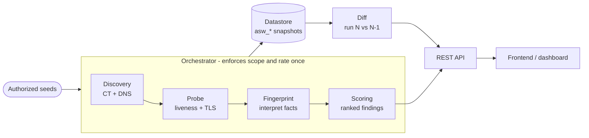

<div align="center">

# 🛰️ ASV — Attack Surface Visibility

**Discover, rank, and track your internet-facing attack surface — before an attacker does.**

[](https://fastapi.tiangolo.com/)
[](https://www.python.org/)
[](https://nextjs.org/)
[](https://www.python-httpx.org/)
[]()

*A student/portfolio security-engineering project — for authorized scanning only.*

[Overview](#overview) • [What it does / doesn't](#scope-what-it-does-and-doesnt-do) • [Architecture](#architecture) • [Getting Started](#getting-started) • [API](#api-reference) • [For the team](#for-the-team)

</div>

---

## Overview

Organizations spin up subdomains, cloud services, APIs, and staging environments
faster than they can track them. Forgotten hosts, expired certificates, and
misconfigured services quietly accumulate into an attack surface far larger than
anyone realizes — and attackers find it during reconnaissance before defenders do.

**ASV runs that reconnaissance against your *own* authorized assets.** You give it
a few seed domains and the scope you're allowed to scan; it expands that into a
ranked, explainable inventory of what's actually exposed on the internet, and
tells you what changed since the last scan. It **observes and fingerprints — it
never exploits.**

The pipeline:

```
seeds ─► discovery ─► probe ─► fingerprint ─► scoring ─► datastore ─► diff
```

---

## Scope: what it does, and doesn't do

**It does:**
- Expand seed domains via **Certificate Transparency** (passive) and optional,
  scope-gated **DNS brute-force** (active).
- **Probe** discovered hosts for live HTTP(S) services and capture headers + TLS
  certificate facts.
- **Fingerprint** each service (tech hints, login/admin surfaces, TLS health).
- **Rank findings** worst-first, each with a plain-language reason.
- **Track change** between scans (new / removed / persisting) via snapshots.

**It does not:**
- Exploit, brute-force credentials, or attempt to gain access.
- Do authenticated/internal scanning — external perspective only.
- Perform a full port sweep or non-HTTP service detection (HTTP(S) ports today).
- Confirm CVEs with proof-of-concept — it flags *likely* exposure, not proof.
- Scan anything outside the authorized scope. **Default-deny**: an empty scope
  scans nothing.

> ⚠️ **Only scan assets you are authorized to scan.** `scanme.nmap.org` is a
> public target the Nmap project provides for exactly this kind of testing.

---

## Architecture

Every stage is a pure, forward-only function passing plain dataclasses; only the
orchestrator touches the database. Network I/O is async (`httpx` + `dnspython`)
with a single semaphore as the global rate limiter, so scans stay polite and one
dead host can never abort a batch.



| Component | Responsibility |
|---|---|
| **Scope gate** (`scope.py`) | The single authorization check. Default-deny; nothing outside authorized domains/CIDRs is ever touched. |
| **Discovery** (`discovery.py`) | Seeds → assets. CT logs (passive) + optional DNS brute-force, auto-disabled on wildcard-DNS domains. |
| **Probe** (`probe.py`) | Assets → live services. Rejects platform placeholder/error responses so phantom hosts don't register. |
| **Fingerprint** (`fingerprint.py`) | Pure interpretation of raw facts — tech, login/admin surface, TLS health. |
| **Scoring** (`scoring.py`) | Rules → findings, worst-first, de-duplicated per host. |
| **Diff** (`diff.py`) | This run vs. the previous completed run. |
| **Datastore** (`models.py`) | Snapshot-stamped SQLAlchemy tables (`asw_*`). |

Full module design and internals: **[`backend/app/attack_surface/README.md`](backend/app/attack_surface/README.md)**.

> **Note:** the backend also carries a broader security toolkit (file/URL/network/
> email/UPI scanners, IOC correlation, MITRE mapping) that ASV is integrated
> into. Those are supporting modules — the focus of this repo is Attack Surface
> Visibility.

---

## Technology Stack

| Layer | Technology |
|---|---|
| Pipeline | Python 3.12, `asyncio`, `httpx`, `dnspython`, `cryptography` |
| Discovery source | Certificate Transparency (crt.sh) |
| Backend / API | FastAPI, JWT auth, SlowAPI rate limiting |
| Datastore | SQLAlchemy (SQLite by default, PostgreSQL supported) |
| Frontend | Next.js (App Router), React, TypeScript, Tailwind |
| Tests | pytest (offline, deterministic) |

---

## Getting Started

### Prerequisites
- Python 3.12
- Node.js 18+ (only if working on the frontend)
- PostgreSQL 14+ *(optional — SQLite is the default and needs no setup)*

### 1. Clone

```bash
git clone https://github.com/Nooronclouds/asv.git
cd asv
```

### 2. Install dependencies

```bash
npm run install:all      # installs frontend deps + backend requirements
```

Backend only:

```bash
cd backend && pip install -r requirements.txt
```

### 3. Configure environment

```bash
cp backend/.env.example backend/.env
```

Then set `backend/.env` (the defaults use SQLite — no database server needed):

```
DATABASE_URL=sqlite:///./asv.db
SECRET_KEY=<generate: python -c "import secrets; print(secrets.token_hex(32))">
```

### 4. Run

```bash
npm run dev
```

- Frontend: `http://localhost:3000`
- Backend + Swagger docs: `http://localhost:8000/docs`

### 5. Run your first scan

Authenticate (`/login`) to get a token, then:

```bash
curl -X POST http://localhost:8000/api/attack-surface/scan \
  -H "Authorization: Bearer <token>" \
  -H "Content-Type: application/json" \
  -d '{"seeds":["scanme.nmap.org"],"authorized_domains":["scanme.nmap.org"],"active":false}'
```

Or drive the pipeline directly — see
[`backend/app/attack_surface/README.md`](backend/app/attack_surface/README.md).

### Run the tests

```bash
cd backend && python -m pytest tests/test_attack_surface_fixes.py -v
```

---

## API Reference

Attack-surface endpoints (all require `Authorization: Bearer <token>`):

| Method | Endpoint | Description |
|---|---|---|
| POST | `/api/attack-surface/scan` | Run a scan over authorized seeds; returns counts, delta, and ranked findings |
| GET | `/api/attack-surface/runs` | List recent scan runs |
| GET | `/api/attack-surface/findings` | Current findings, worst-first |

Request/response shapes are documented in
[`backend/app/attack_surface/README.md`](backend/app/attack_surface/README.md).

<details>
<summary>Auth + supporting security-toolkit endpoints</summary>

| Method | Endpoint | Description |
|---|---|---|
| POST | `/register`, `/login` | Account creation and JWT auth |
| POST | `/api/scan/{file,url,network,email,upi}` | Supporting multi-vector scanners |
| GET | `/scan-history`, `/incidents` | History and correlated incidents |

</details>

---

## For the team

Working on the **UI** or **upgrades**? Start here:

- **UI / dashboard** → the API contract in
  [`backend/app/attack_surface/README.md`](backend/app/attack_surface/README.md)
  has exact request/response JSON. `first_seen == latest run` (or the scan
  response's `delta`) gives you a "what changed" view for free. Frontend pages
  live in `frontend/app/`, components in `frontend/components/`.
- **Add a detection rule** → append a small function to `RULES` in
  `backend/app/attack_surface/scoring.py`. It takes a `Fingerprint`, returns one
  `Finding` (with a mandatory plain-language `rationale`) or `None`.
- **Add a discovery source** → add a collector alongside `_passive_ct` in
  `discovery.py`.
- **Config knobs** (timeouts, concurrency, ports) → all in
  `attack_surface/config.py`, overridable via `ASW_*` env vars.

**One invariant:** in `orchestrator.run_scan`, `_load_previous_findings` must run
*before* the upsert loop — reordering it silently breaks change detection. See
the comment at the call site.

### Folder structure

```
asv/
├── backend/
│   ├── app/
│   │   ├── attack_surface/   # ⭐ the ASV pipeline (+ its own README)
│   │   ├── api/              # FastAPI routes (incl. routes_attack_surface.py)
│   │   ├── core/ db/ schemas/ services/
│   │   └── main.py
│   ├── tests/                # offline regression tests
│   └── requirements.txt
├── frontend/                 # Next.js dashboard
├── docs/                     # spec + design docs
└── package.json              # monorepo dev/install scripts
```

---

## Roadmap

**Done**
- [x] End-to-end pipeline: discovery → probe → fingerprint → scoring → diff
- [x] Passive CT discovery + scope-gated active brute-force
- [x] TLS certificate extraction (expiry / self-signed / issuer)
- [x] Wildcard-DNS guard, real-liveness check, per-host dedup (with regression tests)
- [x] REST API + snapshot-based change tracking

**Next**
- [ ] Frontend dashboard for runs, findings, and diffs
- [ ] Background/async scans for large scopes (currently synchronous)
- [ ] Scheduled recurring scans
- [ ] Expanded discovery sources and port coverage
- [ ] PDF/CSV export of findings

---

## Contributing

Team project — open an issue or PR. Keep pipeline stages pure and add/adjust
tests under `backend/tests/` for any detection or discovery change.

## License

No license file yet — all rights reserved by default until one is chosen.

## Acknowledgements

- [Nmap](https://nmap.org/) (and `scanme.nmap.org` for authorized testing)
- [crt.sh](https://crt.sh/) Certificate Transparency search
- [FastAPI](https://fastapi.tiangolo.com/), [httpx](https://www.python-httpx.org/), [dnspython](https://www.dnspython.org/), [Next.js](https://nextjs.org/)

## Authors

1. **Mohammed Nayef Siddique** ([GitHub](https://github.com/nayefsiddique-eng))
2. **Noor Laiba Maheen**
3. **Sobiya Ayaz**
4. **Nadira Fatima Sireen Sultana**
5. **Mohammed Ameen Ul Haq**

---

<div align="center">

*Built as part of ongoing cybersecurity engineering coursework and portfolio work.*

</div>
