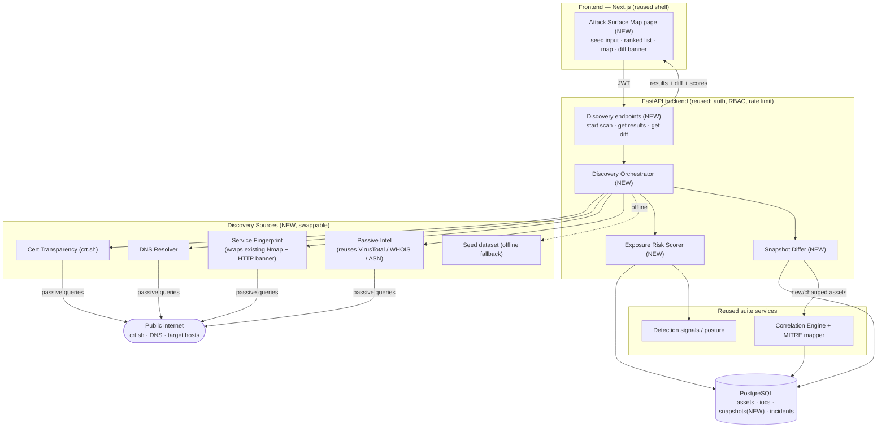

# Attack Surface Visibility — High-Level Design

**Companion to** [ATTACK_SURFACE_SPEC.md](ATTACK_SURFACE_SPEC.md). No code — components, data flow,
and what talks to what. Everything here is an *addition* to the existing Vanguard suite; existing
pieces are reused, not rebuilt.

---

## The one-sentence shape

A new **Discovery Engine** turns one seed domain into a list of exposed assets, a **Risk Scorer**
ranks them, and both feed the **assets/iocs database and dashboard you already have** — while a
**Snapshot Differ** compares each run to the last so newly-appeared assets raise alerts.

---

## Components

**New (what we're adding)**

- **Discovery Orchestrator** — the conductor. Takes a seed domain + scan job, calls each discovery
  source in turn, dedupes results, and hands a clean asset list to persistence. Owns the job lifecycle.
- **Discovery Sources** (independent, swappable collectors):
  - *Cert Transparency source* → queries crt.sh for subdomains.
  - *DNS resolver source* → resolves each candidate to live IPs, drops dead ones.
  - *Service fingerprint source* → wraps the **existing Nmap service** + HTTP banner grab to identify
    open ports/services on live hosts.
  - *Passive-intel source* → reuses the **existing VirusTotal / WHOIS / ASN** lookups for hosting context.
  - *Seed-dataset source* → offline fallback that emits a realistic fixture set (for demos / rate limits).
- **Exposure Risk Scorer** — rule-based. Combines severity of what's exposed × how exposed it is ×
  asset criticality into one explainable score, with a signals breakdown (why).
- **Snapshot Differ** — stores each discovery run as a snapshot, diffs against the previous one, and
  emits "new / changed / disappeared" asset events.
- **Attack Surface Map (frontend)** — a new page: ranked exposure list + grouped map/graph view,
  filters by criticality/status, and the "N new since last scan" banner.

**Reused (already in the suite — no rewrite)**

- FastAPI app, JWT **auth + RBAC**, rate limiting → gate the new discovery endpoints.
- **`assets` and `iocs` tables** → discovery writes here; no new asset store needed.
- **Correlation Engine + MITRE mapper** → turn high-risk / newly-appeared exposures into incidents
  tagged to Reconnaissance techniques.
- **Posture score, detection-signals panel, Next.js dashboard shell** → the map view plugs in beside them.

---

## Component & data-flow diagram

---

## Data flow, step by step

1. **Kick off** — analyst enters a seed domain on the Map page → `start scan` endpoint (JWT + RBAC checked).
2. **Discover** — Orchestrator fans out to the sources: crt.sh gives candidate subdomains → DNS resolver
   keeps the live ones → Fingerprint (Nmap/HTTP) + Passive Intel enrich each host with ports, service,
   ASN, WHOIS. Offline? The seed-dataset source stands in.
3. **Normalize & persist** — Orchestrator dedupes and writes hosts to **`assets`**, domains/IPs to **`iocs`**
   (reusing the existing schema), and records the full run as a **snapshot**.
4. **Score** — Risk Scorer assigns each asset an Exposure Risk Score + signal breakdown; scores feed the
   existing posture/signals machinery.
5. **Diff** — Snapshot Differ compares this run to the prior snapshot → "new / changed / gone" events.
   New or high-risk assets are handed to the **Correlation Engine**, which can open a MITRE-tagged incident.
6. **Present** — the Map page reads back the ranked exposure list, the grouped map, and the
   "N new since last scan" banner. From there the analyst pivots into the existing incident/report flow.

---

## What talks to what (contracts, in words)

- **Frontend ↔ Backend:** only over the authenticated discovery endpoints; frontend never calls sources directly.
- **Orchestrator ↔ Sources:** every source exposes the *same* shape ("given input, return normalized assets"),
  so sources are swappable and testable in isolation — real ones and the seed fallback are interchangeable.
- **Sources ↔ Internet:** passive, read-only queries only (crt.sh, DNS, banner/port read). No exploitation.
- **Backend ↔ Database:** discovery reuses `assets`/`iocs`; adds a `snapshots` table for run-over-run diffing.
- **Differ ↔ Correlation:** the differ only *emits events*; deciding what becomes an incident stays with the
  existing correlation engine, so incident logic lives in one place.

---

## Why this shape

- **Additive, low-risk:** the whole existing suite keeps working; discovery is a new lane feeding known tables.
- **Swappable sources:** the identical-contract design lets the demo run fully offline (seed source) or live
  (real OSINT) without touching the rest.
- **One source of truth for incidents:** scoring and diffing *feed* the correlation engine rather than
  duplicating its logic — consistent with the suite's existing architecture.
